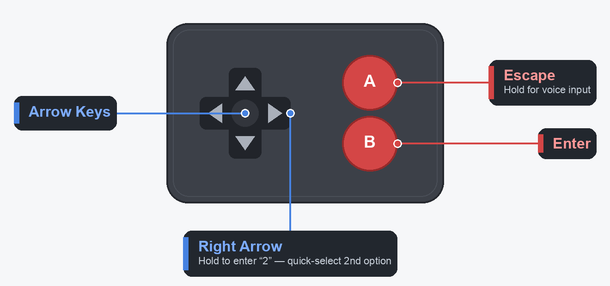

# prompt-controller

Never miss an agent approval prompt again. **prompt-controller** wraps the Codex
and Claude Code CLIs on macOS, watches the terminal for approval prompts, and
automatically focuses your terminal window the moment one appears — so you can
approve it (optionally from a game controller in your hand) and get back to work.

## Background

Coding agents like Codex CLI and Claude Code pause constantly to ask permission:
*"Do you want to run this command?"*, *"Allow this edit?"*. If you've tabbed away
to another app, you never notice — the agent just sits there, blocked, until you
happen to glance back.

prompt-controller fixes that, and it's intentionally simple:

> A wrapper around the `codex` / `claude` binaries that watches the terminal
> title and content for approval prompts, and automatically focuses the terminal
> window when a prompt appears.

No accessibility hacks, no global hotkeys, no clicking GUI buttons. It runs the
real CLI inside a pseudo-terminal (PTY), passes everything through untouched, and
only reacts to the approval menu actually visible in the terminal stream.

## How it works

1. You launch the agent through the wrapper (`claude-cli` instead of `claude`).
2. The wrapper spawns the real CLI on a PTY — as that PTY's *controlling* terminal,
   so window resizes reach it — and forwards all I/O unchanged.
3. It scans the output for an approval prompt. When one appears it:
   - writes a small JSON state file to `/tmp`,
   - posts a macOS notification, and
   - raises and focuses **only the agent's terminal window** — un-minimizing it
     from the Dock if needed — without dragging your other terminal windows
     forward (it marks that one window and activates the app only when needed).
4. While the prompt is unanswered and the terminal isn't focused, it keeps
   nudging (re-focus + re-notify) so you can't miss it.
5. When you answer — or the agent resumes working — it clears the state and stops.

## Quick Start

**Requirements:** macOS, Python 3, and the CLI you want to wrap (`claude` and/or
`codex`) on your `PATH`.

**Verified against:** Claude Code **2.1.173** and codex-cli **0.146.0** (macOS 15,
Apple Terminal). Detection reads what the CLI paints, so a release can change it —
after updating either CLI, run `python3 tests/selftest.py` (see
[Checking detection after a CLI update](#checking-detection-after-a-cli-update)).

```sh
git clone https://github.com/<you>/prompt-controller.git
cd prompt-controller
```

Run your agent through the wrapper instead of directly:

```sh
./claude-cli        # instead of: claude
./codex-cli         # instead of: codex
```

Use the agent exactly as normal. When it asks for approval, your terminal jumps
to the front. Pass through any underlying CLI arguments after `--`:

```sh
./claude-cli -- --model opus
```

Optionally put them on your `PATH` so they work from anywhere:

```sh
ln -s "$PWD/claude-cli" /usr/local/bin/claude-cli
ln -s "$PWD/codex-cli"  /usr/local/bin/codex-cli
```

## Controller setup (optional)

prompt-controller reacts to ordinary keystrokes, so anything that can send arrow
keys, Enter, and Esc can drive the prompts. Both CLIs still take the plain keys —
verified on Claude Code 2.1.173 and codex-cli 0.146.0:

| Key | Claude Code | Codex |
| --- | --- | --- |
| `↑` / `↓` | moves the highlight | moves the highlight |
| `Enter` (plain `\r`) | confirms the highlighted option | confirms the highlighted option |
| `Esc` | rejects the tool call | cancels the command |
| `1`–`3` | selects that option instantly | selects that option instantly |

A tiny Bluetooth game controller makes it possible to approve from across the
room. The tested/recommended one:

[Bluetooth mini game controller (Amazon)](https://www.amazon.com/Controller-Android-Portable-Wireless-Scrolling-Smartphone/dp/B0FLK6TP38/)

Its iOS companion app lets you choose what the controller emulates (keyboard,
Xbox controller, etc.) and remap each button. The recommended setup is the
simplest one, in **keyboard mode**:



| Button | Sends           | Use                       |
| ------ | --------------- | ------------------------- |
| D-pad  | Arrow keys      | Move through menu options |
| A      | `Esc`           | Cancel                    |
| B      | `Enter`         | Confirm selection         |

So at any approval prompt: D-pad to choose, **B** to confirm, **A** to cancel —
without touching the keyboard.

### Karabiner macros (optional)

On top of the basic mapping, a couple of *hold-to-trigger* macros can be added
with [Karabiner-Elements](https://karabiner-elements.pqrs.org/). A working rule
is included at [`karabiner/prompt-controller-karabiner.json`](karabiner/prompt-controller-karabiner.json):

- **Hold Esc** → trigger voice input ([Wispr Flow](https://wisprflow.ai) /
  [superwhisper](https://superwhisper.com)) so you can dictate a reply.
- **Hold D-pad Right** → send `2`, selecting the *second* option in the approval
  menu. **Know what you are granting** — see the scope table below; option 2 is no
  longer always "just for this session".
- **Hold D-pad Down** → `⌘M`, minimizing the agent's window to the Dock when
  you're done reviewing (a prompt un-minimizes it again automatically).

All holds use a 500ms threshold; a quick tap still sends the normal key.

To install it:

1. Copy `karabiner/prompt-controller-karabiner.json` into
   `~/.config/karabiner/assets/complex_modifications/`.
2. In Karabiner-Elements → *Complex Modifications* → *Add rule*, enable
   **prompt-controller (BT mini)**.
3. **Replace the `vendor_id` / `product_id`** in the JSON with your own
   controller's IDs (find them in *Karabiner-EventViewer*). The bundled values
   match one specific device.

### What option `2` actually grants

Number keys select immediately (no Enter), so a hold-to-send macro commits the
choice without you reading the screen. Option 2's scope depends on the prompt:

| Prompt | Option 2 | Scope |
| --- | --- | --- |
| Claude edit/write | *Yes, allow all edits during this session* | this session only |
| Claude Bash | *Yes, and always allow access to `<dir>` from this project* | outlives the session (Claude's own wording: "always … from this project") |
| Codex command | *Yes, and don't ask again for commands that start with `<cmd>`* | **permanent and global** |

Codex's option 2 appends a `prefix_rule(...)` line to `~/.codex/rules/default.rules`,
which applies in *every* directory and survives restarts — it is not session state
and not project state. The rule is matched on the exact command prefix, so it is
narrow, but it never expires. Prune that file to revoke.

If you'd rather the hold gesture never widen permissions, **remap it to `1`**
("Yes" / "Yes, proceed") — that approves the single action and writes nothing.

### Session-only "allow all"

Claude has one built in: option 2 on an edit prompt, or `shift+tab` to cycle to
`⏵⏵ accept edits on`. It lasts for the session and leaves no trace on disk.

Codex has no per-session equivalent — both its option 2 and `/permissions` →
*Approve for me* persist (the latter writes `approvals_reviewer` to
`~/.codex/config.toml`). The only session-scoped route is launch flags, which
write nothing:

```sh
./codex-cli -- -a never -s workspace-write
```

That approves everything the sandbox permits for that session only, still blocking
writes outside the workspace and network access. The trade-off is that it removes
approval prompts entirely — so prompt-controller has nothing to catch that session.

## Configuration

Both wrappers take the same flags:

| Flag                  | Effect                                                                            |
| --------------------- | -------------------------------------------------------------------------------- |
| `--no-notify`         | Don't post macOS notifications                                                    |
| `--no-activate`       | Don't focus the terminal (write state file + notify only)                        |
| `--no-restore`        | Don't restore the previously focused app after the prompt ends                   |
| `--state-file PATH`   | Where to write prompt state                                                       |
| `--terminal-app NAME` | Force which app to focus (`Terminal`, `iTerm2`, `Ghostty`, …). Handy under tmux. |
| `--debug`             | Log state transitions to a file (see note below)                                 |
| `--debug-file PATH`   | Debug log path (default `/tmp/<cli>-cli-wrapper.log`)                             |

Each flag also has an environment-variable form, prefixed per CLI —
`CLAUDE_PROMPT_*` for Claude and `CODEX_PROMPT_*` for Codex (e.g.
`CLAUDE_PROMPT_TERMINAL_APP`, `CODEX_PROMPT_DEBUG_FILE`).

Defaults live as constants at the top of each wrapper:

```python
DEFAULT_AUTO_FOCUS = True       # focus the terminal when a prompt appears
DEFAULT_RESTORE_FOCUS = False   # "unfocus mode": hand focus back afterward
RESTORE_FOCUS_DELAY_SECONDS = 5 # in unfocus mode, review window before unfocusing
```

With `DEFAULT_RESTORE_FOCUS = True` ("unfocus mode"), after you answer a prompt
the terminal stays focused for `RESTORE_FOCUS_DELAY_SECONDS` — a review window —
then focus returns to the app you were in. A new prompt cancels a pending
unfocus. Set the delay to `0` to hand focus back immediately.

Sticky-reminder cadence (same constants in both wrappers): while a prompt is
unanswered and the terminal isn't frontmost, the wrapper re-pulls it forward
every 2s and re-posts the notification on this interval, until you answer.

```python
NOTIFY_REPEAT_INTERVAL_SECONDS = 20.0  # how often to re-notify while a prompt waits
REMIND_WITH_BELL = False               # True also rings the terminal bell each reminder
```

> **Why `--debug` writes to a file:** the wrapper shares the screen with the
> agent's full-screen TUI, so printing debug to the terminal would corrupt its
> rendering (scrolling, a blank bottom line) on every repaint. Debug always goes
> to a log file — watch it with `tail -f /tmp/claude-cli-wrapper.log`.

## Prompt state file

For your own integrations, the current prompt is exposed as JSON at
`/tmp/<cli>-cli-prompt-state.json` while a prompt is active (the file is removed
when no prompt is active, and stale state is cleared on startup):

```json
{
  "active": true,
  "terminalApp": "Terminal",
  "savedFrontmostApp": "Preview",
  "excerpt": "Doyouwanttoproceed?...",
  "pid": 12345
}
```

## Detection details

The Codex wrapper keys off Codex's `[!] Action Required` title marker plus its
approval menu in the terminal stream. **Both signals count; neither suppresses the
other.** The title marker covers command and patch approvals, but Codex sets no
marker for its other blocking menus — the startup *"Do you trust the contents of
this folder?"* prompt, and model-migration / onboarding choices — so the menu
matcher is what catches those. Like Claude Code (below), current Codex positions
each menu word with
cursor-movement escapes instead of literal spaces, so the matcher works on a
whitespace-insensitive form rather than fixed strings — robust to that rendering
and to wording drift. It recognizes numbered `1. Yes` / `2.`–`3. No` menus, the
`Would you like to run…` / `Do you trust…` questions, the `No, and tell Codex
what to do differently` option, and the `Press enter to confirm · esc to cancel`
footer.

The Claude wrapper matches Claude Code's approval menu in the terminal stream.
Current Claude Code positions each word with cursor-movement escapes instead of
literal spaces, so after stripping ANSI the words run together
(`Do you want to create x?` → `doyouwanttocreatex?`). The matcher therefore works
on a whitespace-insensitive form, which is robust to that rendering and to
wording changes. It recognizes:

- Trust-folder prompts (`Do you trust the files in this folder?`)
- Bash / tool approvals (`Do you want to proceed?`)
- Write/edit approvals (`Do you want to create …?`, `… make this edit?`)
- Numbered menus (`1. Yes` + `2./3. No`), `Allow once` / `Always allow` options
- The interactive footer `Esc to cancel · Tab to amend`

It deliberately fires **only** on these blocking menus — never on a finished or
idle chat. A completed turn or empty input box carries none of the menu markers,
so it never demands attention, leaving you free to pause and think or switch
apps. (The terminal title alone can't tell a blocking prompt from a finished turn
— both render as `✳ <task summary>` — so the title's animated braille spinner is
used only as a *busy* signal, to instantly clear the reminder once Claude resumes
after you answer.)

Detection is **level-triggered, not just edge-triggered**. An approval menu is
normally caught on the chunk of output that paints it, but a prompt the CLI has
finished drawing emits nothing more — so if that one chunk is missed, there is no
second chance. Both wrappers therefore re-examine what is still on screen once
output goes quiet, and enter from that. This is what keeps a static prompt from
being lost when it straddles a read boundary or lands in the same repaint as a
spinner update.

## Checking detection after a CLI update

Because detection watches what the CLI paints, a Codex or Claude Code release can
change it out from under the wrapper. A replay test covers both — real captured
approval menus that must fire, and ordinary working output that must stay quiet:

```sh
python3 tests/selftest.py
```

It drives the same `scan_output()` the live wrappers use, against the fixtures in
`tests/fixtures/`, so it fails the way the wrapper would. To cover a new prompt
after an update, record a session's raw PTY output to a file, drop it in
`tests/fixtures/`, and add it to `CASES` in `tests/selftest.py`.

## Troubleshooting

**A prompt is visible but the window doesn't focus**
- Check the state file: `cat /tmp/claude-cli-prompt-state.json`.
- Confirm `terminalApp` is the app you actually want focused; override it with
  `--terminal-app` (Claude) if detection is wrong (common under tmux).

**State stays `active: true` after the prompt is gone**
- Restart the wrapper — startup clears stale state.

**The screen scrolls or leaves a blank bottom line on each redraw**
- That's debug output reaching the terminal. The current wrapper sends `--debug`
  only to a log file, so updating to the latest version stops it.

**The TUI drifts out of alignment after resizing the window** — wrapping breaks,
typed characters appear in the wrong columns, the current output line is hard to
find
- Fixed in the current version. The wrapper gives the CLI the pseudo-terminal as
  its *controlling* terminal, which is what lets the kernel deliver `SIGWINCH` on
  resize; without it the CLI kept rendering at the size it saw at launch. Restart
  the wrapper after updating.

## Files

```text
prompt-controller/
  claude-cli                # launcher for the Claude wrapper
  claude_cli_wrapper.py
  codex-cli                 # launcher for the Codex wrapper
  codex_cli_wrapper.py
  tests/
    selftest.py             # replays recorded prompts through detection
    fixtures/               # captured Codex / Claude Code terminal streams
  karabiner/
    prompt-controller-karabiner.json
  controller-mapping.png    # button-mapping illustration (in the README)
  README.md
```
